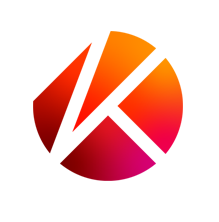

# Klaytn Docs 

## How to contribute 

In line with our commitment to decentralization, Klaytn and its documentations are open source. Anyone can view, edit, fix its contents and make suggestions. You can either create a pull request on GitHub or use GitBook. Find the detailed instructions in [Contributing](https://github.com/Krustuniverse-Klaytn-Group/test-klaytn-docs/blob/master/contributing.md) Make sure to sign our [Contributor License Agreement (CLA)](https://cla-assistant.io/klaytn/klaytn) first. See our [license section](https://github.com/Krustuniverse-Klaytn-Group/test-klaytn-docs/wiki#license) for more details.

### A few things before contributing 

Read our [Code of Conducts](https://github.com/Krustuniverse-Klaytn-Group/test-klaytn-docs/blob/master/code-of-conduct.md) and [Style Guide](https://github.com/Krustuniverse-Klaytn-Group/test-klaytn-docs/blob/master/style-guide.md).

## Need Help? 

If you have any questions, please visit our [Klaytn Developers Forum](https://forum.klaytn.com/).
